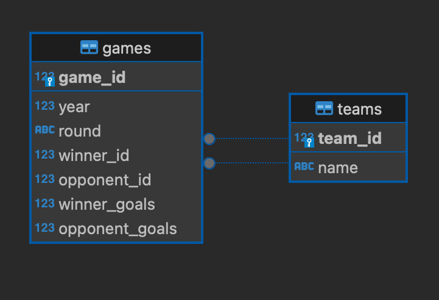
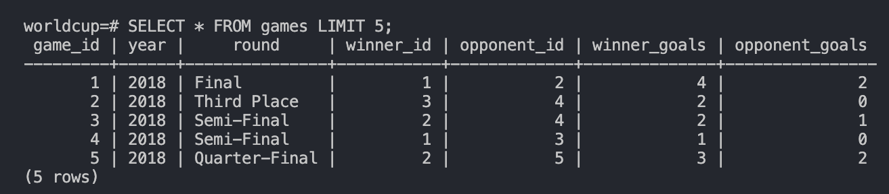
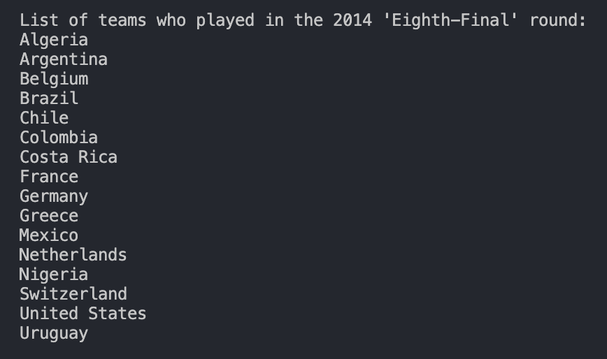

# World Cup Database Using PostgreSQL and Bash
This repository contains code to build a World Cup database from a CSV using PostgreSQL and Bash. 

### Description of files
#### Data
- `games.csv`: Each row contains information on a given knock-out tie in the World Cup.
    - `year`: Year the game was played.
    - `round`: Knock-out round of the tournament, e.g. 'Final'.
    - `winner`: Winning team. 
    - `opponent`: Losing team.
    - `winner_goals`: Number of goals scored by the winning team.
    - `opponent_goals`: Number of goals scored by the losing team.

#### Scripts
- `worldcup.sql`: SQL code to create the database and two empty tables within it, `games` and `teams`.
- `insert_data.sh`: Bash script for inserting the data from `games.csv` into the database.
- `queries.sh`: Bash script that runs some queries to retrieve answers from the database.

### Usage 
First connect to PostgreSQL, run `CREATE DATABASE worldcup;` and connect to the new database with `\c worldcup`. Now open a terminal and run `psql -U <USERNAME> -d worldcup < worldcup.sql`, subsituting in your own username. You'll end up with a database consisting of two empty tables, `games` and `teams`, with the following simple Entity Relationship Diagram (ERD).



The two connectors indicate that `winner_id` and `opponent_id` in `games` are foreign keys and reference `team_id` in `teams`.

To fill the tables, first give exectuable permissions to `insert_data.sh` by running `chmod +x insert_data.sh` from the terminal and then running the script itself. The script `insert_data.sh` has the following functionality.

1. The command 
```
cat games.csv | while IFS="," read YEAR ROUND WINNER OPPONENT WINNER_GOALS OPPONENT_GOALS
``` 
opens the games CSV and reads each line sequentially, saving each column value as a variable.

2. Skipping the headers, it then checks if WINNER (the name of the winning team) isn't in the teams table yet. If so, it inserts it and saves the `team_id`.

3. The same as step 2 but for OPPONENT.

4. Once both teams have been checked and inserted into `teams` if necessary, the line 
```
INSERT_GAME=$($PSQL "INSERT INTO games(year, round, winner_id, opponent_id, winner_goals, opponent_goals) VALUES($YEAR, '$ROUND', $WINNER_ID, $OPPONENT_ID, $WINNER_GOALS, $OPPONENT_GOALS)")
```
inserts the other game information into `games`. 

Returning to the terminal that's running postgres, the query `SELECT * FROM games LIMIT 5` should now return the following output:



The script `queries.sh` contains a set of SQL queries that is run from the command line and printed out in the terminal. First add exectuable permissions with `chmod +x queries.sh` and then run the script itself with `./queries.sh`.

For example, the lines
```
echo -e "\nTotal number of goals in all games from both teams combined:"
echo "$($PSQL "SELECT SUM(winner_goals) +  SUM(opponent_goals) FROM games")"
```
outputs "Total number of goals in all games from both teams combined:
90", while the line
```
echo -e "\nList of teams who played in the 2014 'Eighth-Final' round:"
echo "$($PSQL "SELECT name FROM games LEFT JOIN teams ON games.winner_id = teams.team_id WHERE round='Eighth-Final' AND year=2014 UNION SELECT name FROM games LEFT JOIN teams ON games.opponent_id = teams.team_id WHERE round='Eighth-Final' AND year=2014 ORDER BY name ASC")"
```
should output 




